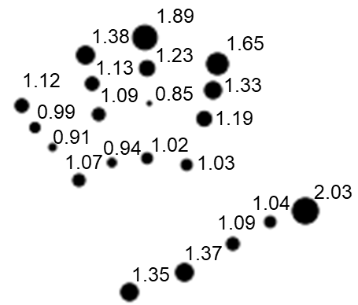

# InterpretableTransformer_SignLanguage
Repository with the code of the paper: [Interpreting Sign Language Recognition using Transformers and MediaPipe Landmarks](https://dl.acm.org/doi/10.1145/3577190.3614143)

---

# First steps

## Installation

To install the python packages, create a new virtual environment and run:

    pip install -r requirements_models.txt

** If problems installing certain libraries, try to update your pip version: pip3 install --upgrade pip
and run again the previous command

Some libraries of MediaPipe could not be compatible with the requirements of the transformer models, in those cases, you can create 
a new virtual environment and install the required libraries for performint the pre-processing:

    pip install -r requirements_preprocessing.txt

## Download datasets
For reproducing the experiments, first you need to download the dataset used for the experiments: 

- [x] [WLASL100](https://dxli94.github.io/WLASL/)
- [x] [IPNHand](https://gibranbenitez.github.io/IPN_Hand/)

Once downloaded, put them in your working directory, in what follows, we will refer to these directories as: 

* \<WLASL100_dir> : Root Directory where we downloaded the WLASL dataset
* \<IPNHand_dir> : Root Directory where we downloaded the IPNHand dataset

# Pre-processing Inputs

## Download pre-processed samples of WLASL and IPNHand
To download the original files employed to train the models with the landmarks extracted from the files, click on the following link (~1GB): 
- [Inputs](https://drive.upm.es/s/AsErgLlRn5WJ0zM)

If you prefer to extract your own features, follow the steps below (notice that in some cases you will need to substitute some of the paths and being working int he correct virtual environment).

## Feature Extraction - Pre-processing

### Generation of files for WLASL
Convert the JSON into 3 CSVs: WLASL100_v0.3.csv, WLASL300_v0.3.csv, WLASL1000_v0.3.csv,
according to the WLASL100, WLASL300 and WLASL1000 datasets

    python3 src/preProcessing/extraProcessingWLASL.py
    --originalJSONfile WLASL100_dir/start_kit/WLASL_v0.3.json
    --out_dir WLASL100_dir

### Frame Extraction

    python3 src/preProcessing/FrameExtractor.py 
    --videos_path WLASL100_dir/WLASL2000
    --out_dir WLASL100_dir/raw_frames_WLASL2000

    

    python3 src/preProcessing/FrameExtractor.py 
    --videos_path IPNHand_dir/IPNHand_videos
    --out_dir IPNHand_dir/raw_frames_IPNHand

### Landmark Extraction
To extract the landmarks, we employed [MediaPipe library](https://google.github.io/mediapipe/)

    python3 src/preProcessing/HandsPoseLandmarksExtractor.py
    --frames_path WLASL100_dir/raw_frames_WLASL2000
    --labels_path WLASL100_dir/WLASL100_v0.3.csv
    --out_dir WLASL100_dir/landmarks

    

### Generation of intermedian files for IPNHand
Compact the landmarks into one single file for all the videos

    python3 src/preProcessing/extraProcessingIPNHand.py 
    --videos_csv_path IPNHand_dir/data/IPN_Hand/videos_list.txt
    --path_DS_distribution IPNHand_dir/Annot_List.txt
    --path_landmarks IPNHand_dir/pose_features
    --out_dir IPNHand_dir/coordinates_frames_labelled.csv

        
    

### Adaptation to SPOTER loader:

    python3 src/preProcessing/DSadaptation2spoterFormat.py 
    --path_DS_distribution WLASL100_dir/WLASL100_v0.3.csv"
    --path_landmarks WLASL100_dir/pose_features
    --nameOfDS WLASL100
    --out_dir WLASL100_dir/data/inputs/WLASL100/MediaPipe_data

    python3 src/preProcessing/DSadaptation2spoterFormat.py 
    --path_DS_distribution IPNHand_dir/Annot_List.txt
    --path_DS_metadata IPNHand_dir/metadata.csv
    --path_landmarks IPNHand_dir/coordinates_frames_labelled.csv
    --nameOfDS IPNHand
    --out_dir IPNHand_dir/data/inputs/IPNHand/MediaPipe_data/x-y

# Arquitectures/Models

## Checkpoints of pre-trained models:
To download the pre-trained models, click on the following link (~9GB): 
- [Checkpoints of pre-trained models](https://drive.upm.es/s/Ng7NBRnvWgBAzvU)

If you prefer to train and evaluate your own models, follow the steps below (notice that in some cases you will need to substitute some of the paths and being working int he correct virtual environment).

## Training Models with WLASL
### 0. Original Baseline SPOTER with VisionAPI data:

    python3 train.py --experiment_name test_WLASL100_Spoter_noNorm_noAugm_SPOTERlandmarks
    --epochs 350 --lr 0.001 
    --training_set_path ../InterpretableTransformer_SignLanguage/data/inputs/VisionAPI_WLASL100/WLASL100_train_25fps.csv
    --validation_set_path ../InterpretableTransformer_SignLanguage/data/inputs/VisionAPI_WLASL100/WLASL100_val_25fps.csv
    --testing_set_path ../InterpretableTransformer_SignLanguage/data/inputs/VisionAPI_WLASL100/WLASL100_test_25fps.csv
    --hidden_dim 85 --n_heads 9 --model2use originalSpoterPE --mediaPipe False

### 1. Original Baseline SPOTER with MediaPipe data (Hands + Pose):

    python3 train.py --experiment_name test_WLASL100_Spoter_noNorm_noAugm_mediaPipe_HandsAndPoseV3 
    --epochs 350 --lr 0.001 
    --training_set_path ../InterpretableTransformer_SignLanguage/data/inputs/WLASL100/MediaPipe_data/x-y/WLASL100_train.csv
    --validation_set_path ../InterpretableTransformer_SignLanguage/data/inputs/WLASL100/MediaPipe_data/x-y/WLASL100_val.csv 
    --testing_set_path ../InterpretableTransformer_SignLanguage/data/inputs/WLASL100/MediaPipe_data/x-y/WLASL100_test.csv 
    --hidden_dim 150 --n_heads 10 --model2use originalSpoterPE --mediaPipe True

### 2. Original Baseline SPOTER with MediaPipe data (Hands + Pose) - WITHOUT Positional Encoding:

    python3 train.py --experiment_name test_WLASL100_Spoter_noNorm_noAugm_mediaPipe_HandsAndPoseV3 
    --epochs 350 --lr 0.001 
    --training_set_path ../InterpretableTransformer_SignLanguage/data/inputs/WLASL100/MediaPipe_data/x-y/WLASL100_train.csv
    --validation_set_path ../InterpretableTransformer_SignLanguage/data/inputs/WLASL100/MediaPipe_data/x-y/WLASL100_val.csv 
    --testing_set_path ../InterpretableTransformer_SignLanguage/data/inputs/WLASL100/MediaPipe_data/x-y/WLASL100_test.csv 
    --hidden_dim 150 --n_heads 10 --model2use originalSpoterNOPE --mediaPipe True

### 3. Explainable Transformer -Class Query- with MediaPipe data (Hands + Pose) (No Positional Encoding):

Training transformer with Class Query at the input of the decoder. Similar to SPOTER architecture.

    python3 train.py --experiment_name test_WLASL100_Spoter_noNorm_noAugm_mediaPipe_HandsAndPoseV3NoPosEmbwQuery_None
    --epochs 350 --lr 0.001 
    --training_set_path ../InterpretableTransformer_SignLanguage/data/inputs/WLASL100/MediaPipe_data/x-y/WLASL100_train.csv
    --validation_set_path ../InterpretableTransformer_SignLanguage/data/inputs/WLASL100/MediaPipe_data/x-y/WLASL100_val.csv 
    --testing_set_path ../InterpretableTransformer_SignLanguage/data/inputs/WLASL100/MediaPipe_data/x-y/WLASL100_test.csv 
    --hidden_dim 150 --n_heads 10 --model2use ownModelwquery --mediaPipe True

## Training Models with IPNHand:
Training the top architecture (or more explainable)

### 0. Original Baseline SPOTER with MediaPipe data (Hand):

     python3 train.py --experiment_name test_IPNHand_Spoter_noNorm_noAugm_mediaPipe_HandswithPE13classes
    --epochs 350 --lr 0.001 
     --training_set_path ../InterpretableTransformer_SignLanguage/data/inputs/IPNHand/MediaPipe_data/x-y/IPNHand_train.csv
    --validation_set_path ../InterpretableTransformer_SignLanguage/data/inputs/IPNHand/MediaPipe_data/x-y/IPNHand_test.csv 
    --testing_set_path ../InterpretableTransformer_SignLanguage/data/inputs/IPNHand/MediaPipe_data/x-y/IPNHand_test.csv 
    --hidden_dim 42 --n_heads 7 --num_classes 12 --model2use originalSpoterPE --mediaPipe True

### 2. Original Baseline SPOTER with MediaPipe data (Hand) - WITHOUT Positional Encoding:

    python3 train.py --experiment_name 1IPNHand_SPOTERnoPE_mediaPipeH 
    --epochs 350 --lr 0.001 
    --training_set_path ../data/inputs/IPNHand/MediaPipe_data/x-y/IPNHand_train.csv 
    --validation_set_path ../data/inputs/IPNHand/MediaPipe_data/x-y/IPNHand_test.csv 
    --testing_set_path ../data/inputs/IPNHand/MediaPipe_data/x-y/IPNHand_test.csv 
    --hidden_dim 42 --n_heads 7 --num_classes 13 --model2use originalSpoterNOPE --mediaPipe True

### 3. Explainable Transformer - Query Class - with MediaPipe data (Hands + Pose) (No Positional Encoding):

Training transformer with Class Query at the input of the decoder. Similar to SPOTER architecture.

    python3 train.py --experiment_name test_IPNHand_Spoter_noNorm_noAugm_mediaPipe_HandsNoPosEmbwQuery13Classes
    --epochs 350 --lr 0.001 
    --training_set_path ../InterpretableTransformer_SignLanguage/data/inputs/IPNHand/MediaPipe_data/x-y/IPNHand_train.csv
    --validation_set_path ../InterpretableTransformer_SignLanguage/data/inputs/IPNHand/MediaPipe_data/x-y/IPNHand_test.csv 
    --testing_set_path ../InterpretableTransformer_SignLanguage/data/inputs/IPNHand/MediaPipe_data/x-y/IPNHand_test.csv 
    --hidden_dim 42 --n_heads 7 --num_classes 12 --model2use ownModelwquery --mediaPipe True

# Results

## Metrics

## Explainability

### 1. WLASL - Explainable Transformer

 - Model with acc: 46.90%

        python3 test.py --experiment_name test_WLASL100_Spoter_noNorm_noAugm_mediaPipe_HandsAndPoseV3_None
        --testing_set_path ../data/inputs/VisionAPI_WLASL100/WLASL100_test_25fps.csv 
        --hidden_dim 108 --n_heads 9 --model2use originalSpoterPE --mediaPipe False --namePE None 
        --load_checkpoint ../src/out-checkpoints/0WLASL100_SPOTER_VisionAPI/test_WLASL100_Spoter_noNorm_noAugm_SPOTERlandmarks/checkpoint_t_15.pth
        
       

 - Model with acc: 60.08%

        python3 test.py --experiment_name test_WLASL100_Spoter_noNorm_noAugm_mediaPipe_HandsAndPoseV3_None
        --testing_set_path ../data/inputs/WLASL100/MediaPipe_data/x-y/WLASL100_test.csv 
        --hidden_dim 150 --n_heads 10 --model2use originalSpoterPE --mediaPipe True --namePE pos 
        --load_checkpoint ../src/out-checkpoints/1WLASL100_SPOTER_mediaPipeHP/test_WLASL100_Spoter_noNorm_noAugm_mediaPipe_HandsAndPoseV3/checkpoint_v_18.pth
        
       
    
 - Model with acc: 60.08%

        python3 test.py --experiment_name test_WLASL100_Spoter_noNorm_noAugm_mediaPipe_HandsAndPoseV3NoPosEmb_None
        --testing_set_path ../data/inputs/WLASL100/MediaPipe_data/x-y/WLASL100_test.csv 
        --hidden_dim 150 --n_heads 10 --model2use originalSpoterNOPE --mediaPipe True
        --load_checkpoint ../src/out-checkpoints/2WLASL100_SPOTERnoPE_mediaPipeHP/test_WLASL100_Spoter_noNorm_noAugm_mediaPipe_HandsAndPoseV3NoPosEmb/checkpoint_t_23.pth
        
 - Model with acc: 62.79%

     
    python3 test.py --experiment_name test_WLASL100_Spoter_noNorm_noAugm_mediaPipe_HandsAndPoseV3NoPosEmbwQuery_None
    --testing_set_path ../InterpretableTransformer_SignLanguage/data/inputs/WLASL100/MediaPipe_data/x-y/WLASL100_test.csv 
    --hidden_dim 150 --n_heads 10 --model2use ownModelwquery --mediaPipe True --namePE wEnc 
    --load_checkpoint ../InterpretableTransformer_SignLanguage/src/out-checkpoints/3WLASL100_SiLT_QueryClass_MediaPipe/test_WLASL100_Spoter_noNorm_noAugm_mediaPipe_HandsAndPoseV3NoPosEmbwQuery/checkpoint_t_19.pth
    

 

### 2. IPNHand -  Explainable Transformer

- Model with acc: 86.10% 

      python3 test.py --experiment_name test_IPNHand_Spoter_noNorm_noAugm_mediaPipe_HandsNoPosEmbwQuery13Classes
      --num_classes 13
      --testing_set_path ../data/inputs/IPNHand/MediaPipe_data/x-y/IPNHand_test.csv 
      --hidden_dim 42 --n_heads 7 --model2use ownModelwquery --mediaPipe True --namePE wEnc 
      --load_checkpoint out-checkpoints/2IPNHand_SiLT_QueryClass_MediaPipe/test_IPNHand_Spoter_noNorm_noAugm_mediaPipe_HandsNoPosEmbwQuery13Classes/checkpoint_v_13.pth

 - Model with acc: 86.65%

 - Model with acc: 86.56%
      
         python3 test.py --experiment_name test_IPNHand_Spoter_noNorm_noAugm_mediaPipe_HandswithPE13classes
          --num_classes 13
          --testing_set_path ../data/inputs/IPNHand/MediaPipe_data/x-y/IPNHand_test.csv 
          --hidden_dim 42 --n_heads 7 --model2use originalSpoterPE --mediaPipe True --namePE pos 
          --load_checkpoint out-checkpoints/0IPNHand_SPOTER_mediaPipeH/test_IPNHand_Spoter_noNorm_noAugm_mediaPipe_HandswithPE13classes/checkpoint_v_7.pth

## FAQs

### License:
This code is leveraged under MIT License, but the datasets employed may have a different license.
The user of the pre-trained models is responsible for checking these licenses and using them under their own responsibility and risk.

### Citation
If you use the code of this work or the generated models, please cite the following paper:

@inproceedings{10.1145/3577190.3614143,
author = {Luna-Jim\'{e}nez, Cristina and Gil-Mart\'{\i}n, Manuel and Kleinlein, Ricardo and San-Segundo, Rub\'{e}n and Fern\'{a}ndez-Mart\'{\i}nez, Fernando},
title = {Interpreting Sign Language Recognition using Transformers and MediaPipe Landmarks},
year = {2023},
isbn = {9798400700552},
publisher = {Association for Computing Machinery},
address = {New York, NY, USA},
url = {https://doi.org/10.1145/3577190.3614143},
doi = {10.1145/3577190.3614143},
abstract = {Sign Language Recognition (SLR) is a challenging task that aims to bridge the communication gap between the deaf and hearing communities. In recent years, deep learning-based approaches have shown promising results in SLR. However, the lack of interpretability remains a significant challenge. In this paper, we seek to understand which hand and pose MediaPipe Landmarks are deemed the most important for prediction as estimated by a Transformer model. We propose to embed a learnable array of parameters into the model that performs an element-wise multiplication of the inputs. This learned array highlights the most informative input features that contributed to solve the recognition task. Resulting in a human-interpretable vector that lets us interpret the model predictions. We evaluate our approach on public datasets called WLASL100 (SRL) and IPNHand (gesture recognition). We believe that the insights gained in this way could be exploited for the development of more efficient SLR pipelines.},
booktitle = {Proceedings of the 25th International Conference on Multimodal Interaction},
pages = {373–377},
numpages = {5},
keywords = {Human-Computer Interaction, Interpretability, MediaPipe Landmarks, Sign Language Recognition, Transformers},
location = {Paris, France},
series = {ICMI '23}
}

### Contact:
If you have any question, or you find a bug in the code, please contact us at: 

- [cristina.lunaj@upm.es](cristina.lunaj@upm.es)

- [manuel.gilmartin@upm.es](manuel.gilmartin@upm.es)

### Acknowledgment 
We would like to thanks to the authors of [SPOTER](https://github.com/matyasbohacek/spoter)
for releasing their code used as baseline to propose our new architectures with interpretable layers. 

